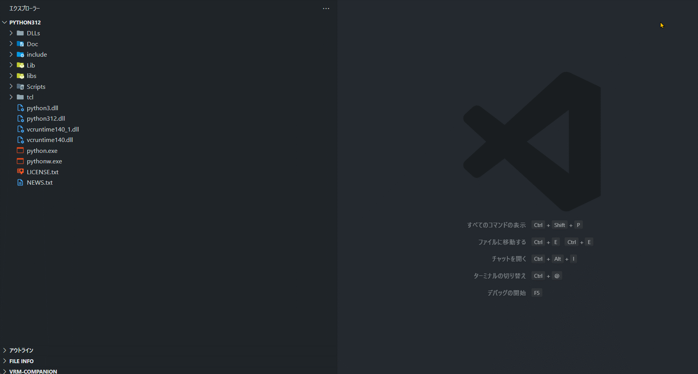

# File Explorer Expand Recursively

Recursively expand or collapse folder nodes in the file explorer tree view.

## Features

- **Recursive Expansion**: Recursively expands all subfolders within selected folders
- **Recursive Collapse**: Recursively collapses all subfolders within selected folders
- **Context Menu Integration**: Right-click on any folder in the explorer to expand or collapse it recursively
- **Multi-Selection Support**: Select multiple folders and expand or collapse them all at once
- **Command Palette Support**: Access the expansion and collapse features via Command Palette
- **Cancellation Support**: Cancel the expansion or collapse process at any time
- **High Performance**: Optimized for fast expansion and collapse with minimal UI blocking
- **Configurable Exclusions**: Skip specified folders during expansion

## Usage

### Expand Single Folder
1. Right-click on any folder in the VS Code file explorer
2. Select "Expand Recursively" from the context menu
3. All subfolders will be expanded automatically

### Expand Multiple Folders
1. Select multiple folders in the file explorer (Ctrl+click or Shift+click)
2. Right-click on one of the selected folders
3. Choose "Expand Recursively" to expand all selected folders

### Expand All Workspace Folders
1. Open Command Palette (`Ctrl+Shift+P` or `Cmd+Shift+P`)
2. Type "Expand Recursively" and press Enter
3. All workspace folders will be expanded



### Collapse Single Folder
1. Right-click on any folder in the VS Code file explorer
2. Select "Collapse Recursively" from the context menu
3. All subfolders will be collapsed automatically

### Collapse Multiple Folders
1. Select multiple folders in the file explorer (Ctrl+click or Shift+click)
2. Right-click on one of the selected folders
3. Choose "Collapse Recursively" to collapse all selected folders

### Collapse All Workspace Folders
1. Open Command Palette (`Ctrl+Shift+P` or `Cmd+Shift+P`)
2. Type "Collapse Recursively" and press Enter
3. All workspace folders will be collapsed


## Configuration

### Exclude Patterns

You can configure which folders to exclude from recursive expansion:

```json
{
  "fileExplorer.expandRecursively.excludePatterns": [
    "custom_folder_to_exclude",
    "another_folder",
    "temp*"
  ]
}
```

**Pattern matching:**
- Exact name matching (case-insensitive)
- Simple glob patterns with `*` wildcard support

## Requirements

Visual Studio Code version 1.74.0 or higher

## License

Licensed under MIT